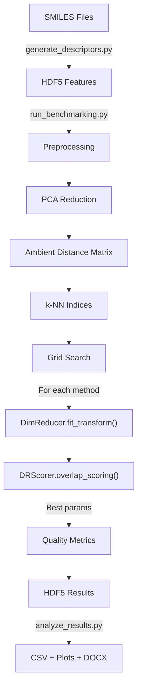

# Architecture

## Package Structure

```
src/cdr_bench/
├── dr_methods/
│   └── dimensionality_reduction.py   # DimReducer: unified wrapper for PCA/UMAP/t-SNE/GTM
├── optimization/
│   ├── optimization.py               # Optimizer: grid search over hyperparameters
│   └── params.py                     # Parameter dataclasses for each method
├── scoring/
│   ├── scoring.py                    # DRScorer: NN overlap, co-ranking, trustworthiness
│   ├── chemsim_stat.py               # Chemical similarity statistics
│   ├── scaffold_stat.py              # Scaffold frequency analysis (F50)
│   └── network_stat.py              # Network topology metrics
├── io_utils/
│   ├── io.py                         # HDF5 I/O, TOML config loading/validation
│   ├── data_preprocessing.py         # Scaling, PCA, duplicate removal
│   └── prepare_lolo.py               # Leave-one-library-out splitting
├── features/
│   ├── feature_preprocessing.py      # Morgan fingerprints, feature filtering
│   ├── physchem.py                   # Physicochemical descriptors (RDKit)
│   └── chemdist_features.py          # GNN embeddings (DGL-Life + PyTorch)
└── visualization/
    ├── visualization.py              # Radar charts, network visualization
    ├── visualization_3D.py           # 3D scatter plots (Plotly)
    └── visualize_stats.py            # Statistics visualization
```

## Core Abstractions

### DimReducer

A unified wrapper that delegates to PCA (scikit-learn), UMAP (umap-learn), t-SNE (openTSNE), or GTM (ChemographyKit). Exposes a consistent `fit`/`transform`/`fit_transform` interface. Parameters are passed via typed dataclasses (`UMAPParams`, `TSNEParams`, etc.) and can be updated at runtime with `update_params()`.

### Optimizer

Performs exhaustive grid search over parameter combinations. For each combination, it calls `DimReducer.update_params()`, fits the model, and scores using `DRScorer.overlap_scoring()`. Tracks the best parameters, model, and transformed coordinates.

### DRScorer

Evaluates DR quality by comparing nearest-neighbor structure between the ambient (high-dimensional) and latent (low-dimensional) spaces. Uses precomputed k-NN indices from the ambient space (stored in `ScoringParams`). Distance calculations use Numba JIT-compiled functions for performance.

## Data Flow



## Configuration System

All behavior is driven by TOML configuration files:

- `bench_configs/run_benchmarking.toml` -- Main benchmarking parameters
- `bench_configs/features.toml` -- Descriptor generation settings
- `bench_configs/method_configs/*.toml` -- Hyperparameter grids per method

Configuration is loaded with `load_config()` and validated with `validate_config()` before use.

## HDF5 Data Model

HDF5 is used throughout for hierarchical storage of molecular data, features, and results. See [Data Pipeline](../user-guide/data-pipeline.md#hdf5-file-formats) for the schema specification.

## Performance

- **Numba JIT**: Distance calculations (`euclidean_distance_square_numba`, `tanimoto_int_similarity_matrix_numba`, `fill_coranking_matrix_numba`) are compiled to machine code at first call
- **pandarallel**: Parallel pandas operations for feature generation
- **GPU**: ChemDist embedding generation uses PyTorch with optional CUDA acceleration

## Import Conventions

Scripts use absolute imports from the project root:

```python
from src.cdr_bench.optimization.params import UMAPParams
from src.cdr_bench.scoring.scoring import calculate_distance_matrix
from src.cdr_bench.io_utils.io import load_config, validate_config
```
