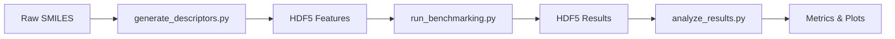

# Data Pipeline

## Overview

The benchmarking pipeline has three main stages: descriptor generation, optimization, and analysis.



## Stage 1: Descriptor Generation

**Script:** `scripts/generate_descriptors.py`

Converts SMILES strings into numerical molecular descriptors:

| Descriptor | Dimensions | Source |
|-----------|-----------|--------|
| Morgan fingerprints (`mfp_r2_1024`) | 1024 | RDKit (radius=2, count-based) |
| MACCS keys (`maccs_keys`) | 167 | RDKit |
| ChemDist embeddings (`embed`) | 16 | DGL-Life GNN model |

Processing steps:

1. Load SMILES from input files
2. Generate fingerprints/embeddings for each molecule
3. Remove duplicate molecules (based on descriptor arrays)
4. Optionally remove constant features (zero-variance columns)
5. Save to HDF5

## Stage 2: Benchmarking

**Script:** `scripts/run_benchmarking.py`

For each dataset and descriptor type:

1. **Preprocessing** -- Remove duplicates, apply scaling (standardize, minmax, or none)
2. **PCA reduction** -- Reduce to `n_components` dimensions, save ambient-space distances
3. **Grid search optimization** -- For each DR method (UMAP, t-SNE, GTM), search over hyperparameter combinations and score using nearest-neighbor overlap
4. **Metric calculation** -- Compute quality metrics for the best parameters at multiple k values

### Optimization Modes

- **In-sample** (`insample`): Train and evaluate on the same dataset
- **Out-of-sample** (`outsample`): Train on one dataset, evaluate on a held-out validation set. Requires `val_data_path` in the config.

### Distance Metrics

- **Euclidean**: Standard L2 distance on scaled descriptors
- **Tanimoto**: Bit-vector similarity for binary fingerprints

## Stage 3: Analysis

**Script:** `scripts/analyze_results.py`

Aggregates metrics across datasets and produces:

- Per-dataset CSV files with all metrics
- Comparison plots (PNG) for AUC, Qlocal, Qglobal
- Formatted summary tables (DOCX)

## HDF5 File Formats

### Input Format

Required structure validated by `check_hdf5_file_format()`:

```
input.h5
├── dataset/
│   ├── smi        (str array)    # SMILES strings
│   └── dataset    (str array)    # Dataset identifiers
└── features/
    ├── embed        (float, N x D)  # Any descriptor array
    ├── mfp_r2_1024  (float, N x D)  # Any descriptor array
    └── maccs_keys   (float, N x D)  # Any descriptor array
```

The `dataset` group must contain at least `smi` and `dataset` keys. The `features` group contains one or more descriptor arrays.

### Output Format

Results from `run_benchmarking.py`:

```
results.h5
├── dataframe/
│   └── ...                        # Metadata columns
├── {feature_name}                 # Feature array (N x D)
├── {METHOD}_metrics/
│   ├── nn_overlap_best  (float)   # Best NN overlap score
│   ├── AUC              (float)   # Area under co-ranking curve
│   ├── kmax             (int)     # Optimal k from co-ranking
│   ├── Qlocal           (float)   # Local quality measure
│   ├── Qglobal          (float)   # Global quality measure
│   └── ...                        # Additional metrics
└── {METHOD}_coordinates           # 2D embedding (N x 2)
```

Where `{METHOD}` is one of `UMAP`, `tSNE`, `GTM`, `PCA`.

## Quality Metrics

| Metric | Range | Measures |
|--------|-------|----------|
| **PNN** (NN overlap) | 0--100% | Fraction of nearest neighbors preserved |
| **QNN** | 0--1 | Co-ranking quality per neighborhood size |
| **LCMC** | -1--1 | Local continuity meta-criterion |
| **AUC** | 0--1 | Area under QNN curve |
| **kmax** | 1--N | Optimal neighborhood size |
| **Qlocal** | 0--1 | Quality at small neighborhoods |
| **Qglobal** | 0--1 | Quality at large neighborhoods |
| **Trustworthiness** | 0--1 | Are LD neighbors true HD neighbors? |
| **Continuity** | 0--1 | Are HD neighbors preserved in LD? |
| **Distance correlation** | -1--1 | Spearman correlation of pairwise distances |

## Notebooks

Interactive examples are available in `notebooks/`:

- `io.ipynb` -- Reading and writing HDF5 files
- `visualization.ipynb` -- Plotting embeddings and metrics
- `chemdiv_analysis.ipynb` -- Chemical diversity analysis
- `fisher_id_analysis.ipynb` -- Intrinsic dimensionality analysis
